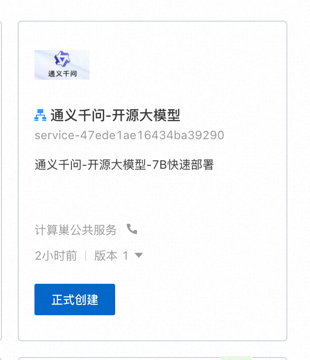
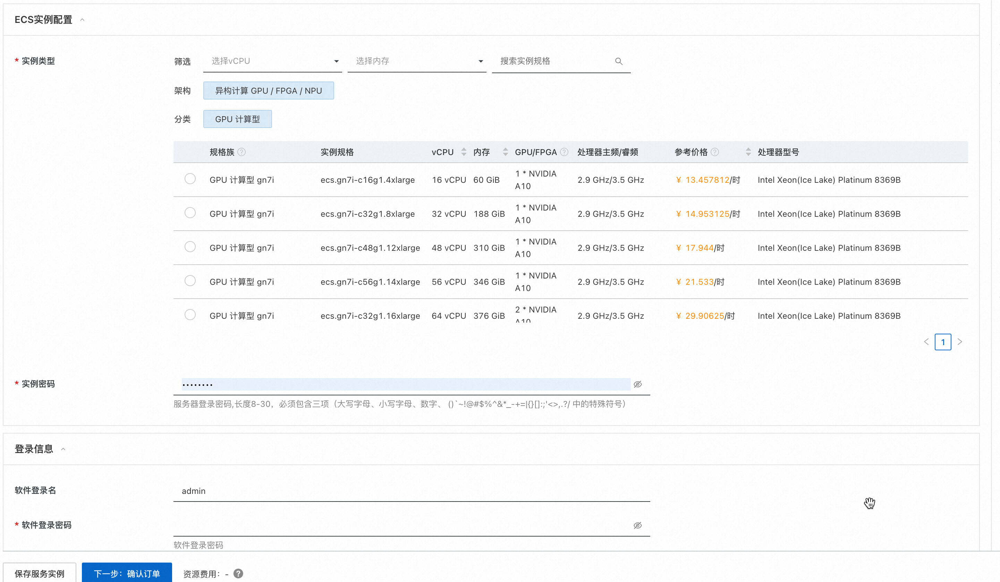
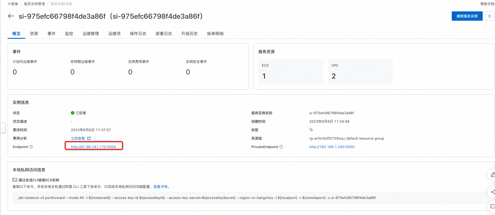

# 通义千问---计算巢专属部署上线啦

## 背景介绍
继海外开源大模型体系推出并实现商用化后，8月3日，阿里云宣布其自研的大模型通义千问正式开源，成为首个宣布大模型开源的大型中国互联网科技公司。具体来看，通义千问70亿参数的通用模型Qwen-7B和对话模型Qwen-7B-Chat，均上架在AI模型社区魔搭ModelScope，开源、免费、可商用。
8.8日，计算巢上线通义千问专属部署方案，3分钟完成一键部署体验

## 方案实践
1. [登录阿里云计算巢控制台](https://computenest.console.aliyun.com/user/cn-hangzhou/serviceInstanceCreate?ServiceId=service-47ede1ae16434ba39290)，进入通义千问服务创建界面，根据界面提示，模版选择gpu集群版，填写相关参数（软件登录名及登录密码很重要，后面访问WebUI需要用到），填写完成点击确认订单。
    
    
    

    | 参数组 | 参数项 | 示例 | 说明 |
    | --- | --- | --- | --- |
    | 服务实例名称 |  | test | 实例的名称 |
    | 地域 | 部署地域 | 新加坡 | 选中服务实例的地域，因为一些模型在国内无法下载访问，建议选择中国香港或海外地域 |
    | 可用区配置 | 部署区域 | 可用区I | 地域下的不同可用区域 |
    | 付费类型配置 | 付费类型 | 按量付费 或 包年包月 |  |
    | ECS实例配置 | 实例类型 | ecs.gn6i-c4g1.xlarge | 实例规格，可以根据实际需求选择 |
    | ECS实例配置 | 实例密码 |  | 设置实例密码。长度8，30个字符，必须包含三项（大写字母、小写字母、数字、()`!@#$%^&*-+={}[]:;'<>,.?/ 中的特殊符号） |
    | 登录信息 | 软件登录名 | admin | 设置软件登录名，默认为admin |
    | 登录信息 | 软件登录名密码 |  | 设置软件登录密码 |
    | 网络配置 | 专有网络IPv4网段 | 192.168.0.0/16 | VPC的ip地址段范围 |
    | 网络配置 | 交换机子网网段 | 192.168.0.0/24 | 交换机子网网段 |

2. 勾选我已阅读并同意《计算巢服务协议》，点击"立即创建"按钮。
   
   

3. 查看部署进度。 点击去列表页查看，可以看到刚刚创建的服务实例以及服务部署进度。
    

4. 访问等待状态变为"已部署"后，点击详情，进入对应的服务实例后，可以在页面上获取Endpoint以访问服务。
    

5. 点击Endpoint后面的链接，输入第1步设置的软件登录名及密码。
    

6. 完成验证后即可访问：
    

## 总结
本文介绍了通义千问的详细功能实践，计算巢在私有化部署(cloud op）场景下提供一键部署、高效运维、弹性伸缩等功能，提供详细的报价信息、资源分组、分账展示等功能，方便客户在解决方案类场景下快速部署落地。场景合作请钉钉联系 075590
